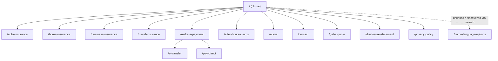

# CSCInsurance.ca 公共网站爬取与前端重构审计报告

## 范围与方法

本次审计目标是为 entity["company","CSC Insurance","insurance brokerage markham on canada"] 的公开网站（`https://www.cscinsurance.ca/`）做“可重构”的信息抓取与前端审计：覆盖公开可访问页面，不尝试任何登录/鉴权；若存在被登录保护的链接，仅记录但不进入。citeturn4view0

爬取策略以“站内可达性”为准：从主页导航与页脚出发做广度遍历，并结合搜索引擎可见的站内 URL 补全非导航页（例如孤立/薄内容页）。citeturn4view0turn17view0

重要限制说明（会影响部分字段的“可解析度”）：
- 由于本环境对页面做了“可读文本抽取”，`<head>` 内的 **meta description**、完整脚本/样式清单、以及 **表单字段结构**（input/label/name/校验规则）在多页上无法可靠还原，因此在输出中会标注为“未暴露/需二次确认”。citeturn10view0turn8view3
- 站点资源域名显示大量图片来自 `images.squarespace-cdn.com`，结合第三方技术指纹信息，站点大概率基于 entity["company","Squarespace","website builder platform"] 构建；这会影响组件抽取与前端迁移路径（例如：从 CMS 模块到 React/Vue 组件的映射）。citeturn12view0turn7search12

## 执行摘要

网站信息架构非常精简：围绕四条主营线（车险/房产险/商业险/旅行险）+ 支付入口 + 非工作时间理赔入口 + About/Contact/统一报价入口。整体更像“获客型 Brochure Site”，核心转化点集中在“Get a Quote/Start/Let’s get started”等 CTA。citeturn4view0turn5view0turn8view3

对重构最关键的发现如下（直接影响 SEO、可访问性、内容可信度与可维护性）：
- **标题与标题层级不一致**：多页正文首屏以 `##`（H2）充当主标题，疑似缺失 H1；而产品线页有 H1。该模式会削弱语义结构与可访问性，也可能影响搜索结果标题生成逻辑。citeturn8view0turn8view2turn10view0turn8view3turn5view0
- **旅行险页存在模板占位文本**：中段出现与保险无关的通用建站文案，属于明显内容污染，影响专业度与 SEO。citeturn8view6
- **隐私政策疑似电商模板**：文本包含“购买/订单信息/配送地址/信用卡”等措辞与行为广告退出链接，可能与经纪业务实际数据流不匹配，存在合规与信任风险；同时公司地址在不同页面出现不一致（主页/联系页 vs 隐私页）。citeturn8view5turn4view0turn10view0
- **存在薄内容/孤立页面**：`/home-language-options` 几乎无正文内容，可能被索引并造成“薄内容”站点评分问题，应删除、重定向或补齐真实语言选择说明。citeturn17view0
- **支付与理赔页外链密集**：`/make-a-payment`、`/pay-direct`、`/after-hours-claims` 依赖外部支付/保险公司站点；重构时需强化“离站提示、可用性（移动端一键拨号/复制）、异常场景与可访问性语义”。citeturn8view0turn11view1turn8view1

## 站点地图与页面树

下表为本次发现的**完整公开页面集合**（共 15 个可访问 URL），包含：URL、页面标题、推断 HTTP 状态、爬取深度、父页面来源与证据。页面标题直接来自页面 `<title>`（在抓取视图抬头显示）。citeturn4view0turn17view0

| Crawl Depth | Parent Page | URL | Page Title | HTTP Status（推断） | 备注 | 证据 |
|---:|---|---|---|---|---|---|
| 0 | — | `https://www.cscinsurance.ca/` | CSC Insurance | 200（可打开） | 主页；含主导航与合作伙伴 Logo 墙 | citeturn4view0 |
| 1 | `/` | `https://www.cscinsurance.ca/auto-insurance` | Auto Insurance - Car Insurance Quotes — CSC Insurance | 200（可打开） | 车险产品线页（H1 存在） | citeturn5view0 |
| 1 | `/` | `https://www.cscinsurance.ca/home-insurance` | Home Insurance - Property Insurance Quotes — CSC Insurance | 200（可打开） | 房产险产品线页（H1 存在） | citeturn5view1 |
| 1 | `/` | `https://www.cscinsurance.ca/business-insurance` | Business Insurance - Commercial Insurance Quotes — CSC Insurance | 200（可打开） | 商业险产品线页（H1 存在） | citeturn9view0 |
| 1 | `/` | `https://www.cscinsurance.ca/travel-insurance` | Travel Insurance - Travel Insurance Quotes — CSC Insurance | 200（可打开） | 旅行险产品线页（含模板占位文本） | citeturn8view6 |
| 1 | `/` | `https://www.cscinsurance.ca/make-a-payment` | Make a Payment - Pay Online — CSC Insurance | 200（可打开） | 支付入口聚合页（外链多） | citeturn8view0 |
| 2 | `/make-a-payment` | `https://www.cscinsurance.ca/e-transfer` | Pay Direct - Pay Online — CSC Insurance | 200（可打开） | e-transfer 指引页；**title 可能不匹配内容** | citeturn11view0 |
| 2 | `/make-a-payment` | `https://www.cscinsurance.ca/pay-direct` | Pay Direct - Pay Online — CSC Insurance | 200（可打开） | 直付保险公司列表页 | citeturn11view1 |
| 1 | `/` | `https://www.cscinsurance.ca/after-hours-claims` | After Hours Claims - 24 Hour Hotline — CSC Insurance | 200（可打开） | 非工作时间报案：承保公司 + 热线 | citeturn8view1 |
| 1 | `/` | `https://www.cscinsurance.ca/about` | Markham Ontario  Insurance Brokerage - About Us — CSC Insurance | 200（可打开） | About 页；主标题用 H2 呈现 | citeturn8view2 |
| 1 | `/` | `https://www.cscinsurance.ca/contact` | Markham Ontario Insurance Brokerage - Contact Us — CSC Insurance | 200（可打开） | 联系页；文本提示“form below”（字段未暴露） | citeturn10view0 |
| 1 | `/` | `https://www.cscinsurance.ca/get-a-quote` | Get a Quote — CSC Insurance | 200（可打开） | 统一报价入口；主标题用 H2 呈现 | citeturn8view3 |
| 1 | `/` | `https://www.cscinsurance.ca/disclosure-statement` | Disclosure Statement — CSC Insurance | 200（可打开） | 佣金/或有佣金披露 | citeturn8view4 |
| 1 | `/` | `https://www.cscinsurance.ca/privacy-policy` | Privacy Policy — CSC Insurance | 200（可打开） | 隐私政策；含 Google Analytics 描述与多处外链 | citeturn8view5 |
| 1 | （未从导航发现） | `https://www.cscinsurance.ca/home-language-options` | Home language options — CSC Insurance | 200（可打开） | 薄内容疑似孤立页 | citeturn17view0 |

站点结构示意（Mermaid，可直接用于文档/README）：



## 页面级结构化清单

### 页面结构与内容抽取表

下表尽量按你的字段要求输出（URL、title、meta description、H1/H2、摘要、CTA、表单、图片、资源、脚本/动态内容）。其中 **meta description、表单字段名、按钮 CSS selector、完整脚本/CSS 列表** 在抓取视图中普遍未暴露，因此以“未暴露/需二次确认”标注。citeturn10view0turn8view3turn4view0

| URL | Title | Meta Description | H1 | H2（按出现顺序） | 主文案摘要（中文 100–200 字符） | 主要 CTA（文本 → 目标） | 表单与字段 | 图片/资源（文件名/线索） | scripts/CSS/动态内容线索 | 证据 |
|---|---|---|---|---|---|---|---|---|---|---|
| `https://www.cscinsurance.ca/` | CSC Insurance | 未暴露（需二次确认） | Get the insurance coverage you need at the best price. | A few of our success partners.; Visit us. | 展示四类保险入口（车险、房产、商业、旅行）与合作保险公司Logo墙，突出“Get Started”引导用户进入报价流程；顶部导航含Payment与After Hours Claims等快捷入口；页尾给出Markham地址、营业时间、电话/传真/邮箱与社媒。 | Get Started →（目标未在文本中暴露）；Get a Quote → `/get-a-quote`；服务入口 → 各险种页 | 无表单（获客入口聚合） | hero：`unsplash-image-Wr3comVZJxU.jpg`；合作方 logo：`aviva-logo.png` 等；页脚 logo：`CSCInsurance_PrimaryLogo.png` | 图片来自 Squarespace CDN；页脚外链 entity["company","Instagram","social media platform"]；含外链 `maxinsurance.ca` | citeturn4view0turn12view0 |
| `https://www.cscinsurance.ca/auto-insurance` | Auto Insurance - Car Insurance Quotes — CSC Insurance | 未暴露（需二次确认） | Auto insurance. | At CSC Insurance…; Do I need car insurance?; What type…?; How much…?; How do I get…?; Get a car insurance quote. | 解释安省车险强制要求、基础与可选保障、保费影响因素（驾驶记录/里程/车型/居住地等），强调经纪人可比价与寻找折扣；两处CTA将用户导向报价（Let’s get started/Start），并提示通过页面下方表单提交信息。 | Let’s get started → `/get-a-quote`；Start → `/get-a-quote` | 文案提示“form below”，字段未暴露（需在 CMS/DevTools 确认） | 页脚 logo：`CSCInsurance_PrimaryLogo.png`；hero 图未暴露文件名 | 结构为“Hero + FAQ(H2) + CTA”；疑似嵌入式表单（动态渲染） | citeturn5view0turn13view0 |
| `https://www.cscinsurance.ca/home-insurance` | Home Insurance - Property Insurance Quotes — CSC Insurance | 未暴露（需二次确认） | Property insurance. | At CSC Insurance…; Do I need home insurance?; What type…?; How much…?; How do I get…?; Get a home insurance quote. | 概述安省房屋/公寓/租客保险：法律非强制但贷款/房东可能要求；介绍named perils、broad、comprehensive等保单层级及保费因素（重建成本/位置/理赔史等）。页面以两处CTA引导进入报价，并提示填写表单。 | Let’s get started → `/get-a-quote`；Start → `/get-a-quote` | 文案提示“contact form below”，字段未暴露 | 页脚 logo：`CSCInsurance_PrimaryLogo.png`；hero 图未暴露文件名 | 与车险页同模板（可组件化） | citeturn5view1turn13view1 |
| `https://www.cscinsurance.ca/business-insurance` | Business Insurance - Commercial Insurance Quotes — CSC Insurance | 未暴露（需二次确认） | Business insurance. | At CSC Insurance…; What is business insurance?; Is commercial insurance required?; What coverage…?; How do I get…?; Get a commercial insurance quote. | 说明商业保险用于覆盖经营中的责任与诉讼风险（破坏、受伤、盗窃、专业错误等），并提示不同业态需定制；介绍常见保障如CGL、商业车险、E&O、业务中断、产品责任与网络险。通过“Let’s get started/Start”导向报价并提示填写表单。 | Let’s get started → `/get-a-quote`；Start → `/get-a-quote` | 文案提示“fill out the form below”，字段未暴露 | 页脚 logo：`CSCInsurance_PrimaryLogo.png`；hero 图未暴露文件名 | 与其他产品线页同模板（可做“产品页通用模板组件”） | citeturn9view0turn13view2 |
| `https://www.cscinsurance.ca/travel-insurance` | Travel Insurance - Travel Insurance Quotes — CSC Insurance | 未暴露（需二次确认） | Travel insurance. | At CSC Insurance…; Do I need travel insurance?; What type…?; How much does…?; How do I get…?; Get a travel insurance quote. | 讲解旅行险常见保障：紧急医疗（牙科/住院/救护/遣返等）与行程取消/中断，提示安省省医保不再覆盖境外医疗；页面提供两处CTA导向报价。但中段夹杂与保险无关的模板占位文案（关于讲故事/建站），需清理以免影响专业度与SEO。 | Let’s get started → `/get-a-quote`；Start → `/get-a-quote` | 文案提示“Start below”，字段未暴露 | 页脚 logo：`CSCInsurance_PrimaryLogo.png`；hero 图未暴露文件名 | **存在明显模板占位文本**（内容污染） | citeturn8view6turn13view3 |
| `https://www.cscinsurance.ca/make-a-payment` | Make a Payment - Pay Online — CSC Insurance | 未暴露（需二次确认） | （疑似缺失） | Make a payment. | 提供三种缴费路径：通过CSC发票e-transfer、跳转第三方policypayments.com刷卡、以及“Pay direct”跳转到各保险公司在线支付；每项配图+简短说明。属于交易/账单入口页，外链与安全提示较多，适合在重构中强化信任与异常处理提示。 | Send an e-transfer → `/e-transfer`；Pay by credit card → `policypayments.com`；Pay direct → `/pay-direct` | 无表单 | 图：`pay-by-e-transfer.png`（线索）；`pay-by-credit-card.png`（线索）；页脚 logo | 外链到第三方支付站与多家保险公司站点 | citeturn8view0turn24view0 |
| `https://www.cscinsurance.ca/e-transfer` | Pay Direct - Pay Online — CSC Insurance | 未暴露（需二次确认） | （疑似缺失） | Send an e-transfer. | 指导客户按发票信息发送电子转账：收款邮箱payment@cscinsurance.ca、金额取自发票总额、备注填写客户号/保单号/被保险人；并提供发票示例图与联系邮箱。页面信息简短但关键，建议在重构中增加复制按钮与常见问题（到账时间/是否需安全问题等）。 | 无明显 CTA（主要为操作指引） | 无表单 | 示意图线索：`CSC%2BINVOICE.png`（发票示例） | 页面主要是静态指引 + 图片示例 | citeturn11view0turn23view0 |
| `https://www.cscinsurance.ca/pay-direct` | Pay Direct - Pay Online — CSC Insurance | 未暴露（需二次确认） | （疑似缺失） | Pay direct. | 列出可直接向保险公司在线缴费的入口清单（Aviva、Economical、RSA、CAA、Gore Mutual、SGI、Intact、Pafco、Unica、Echelon、Pembridge、Wawanesa等），每项为外链。页面属于资源导航类，重构应增加分组/搜索、外链告知与可访问性优化（列表语义、键盘操作）。 | 外链列表（见正文） | 无表单 | 无下载资源；页脚 logo | 外链密集（多域名）；属于“资源目录型”页面 | citeturn11view1 |
| `https://www.cscinsurance.ca/after-hours-claims` | After Hours Claims - 24 Hour Hotline — CSC Insurance | 未暴露（需二次确认） | （疑似缺失） | After hours claims. | 为非工作时间报案提供承保公司清单与24小时热线电话，并附各公司理赔网站外链（如Aviva、Echelon、Jevco、SGI、CAA、Economical等）。该页强调紧急使用场景，重构应突出一键拨号、移动端可触达导航与信息层级，避免长列表难以扫描。 | 外链列表（理赔站点） | 无表单 | 无下载资源；页脚 logo | 外链 + 电话号码（移动端应支持 `tel:`） | citeturn8view1 |
| `https://www.cscinsurance.ca/about` | Markham Ontario  Insurance Brokerage - About Us — CSC Insurance | 未暴露（需二次确认） | （疑似缺失） | About us.; Making insurance simple…; Chat with us. | 介绍经纪业务定位：独立保险经纪服务大多伦多地区，合作加拿大多家保险公司，覆盖车/房产/商业/旅行险；强调团队可提供英语、粤语与普通话服务，并以“Get Started”引导进入报价。重构可补充团队资质、执照信息与差异化优势以增强信任。 | Get Started → `/get-a-quote` | 文案提示“fill out the contact form below”，字段未暴露 | 页脚 logo；正文含一张图片（文件名未暴露） | 页面为“品牌/信任”层；标题含地理词（Markham Ontario） | citeturn8view2turn20view0 |
| `https://www.cscinsurance.ca/contact` | Markham Ontario Insurance Brokerage - Contact Us — CSC Insurance | 未暴露（需二次确认） | （疑似缺失） | Get in touch.; Visit us. | 提供联系入口：号召用户拨打电话或填写联系表单，并列出办公地址（Allstate Parkway）、营业时间、邮箱、电话与传真。页面在抓取视图中未展示表单字段，推测为嵌入式表单模块；重构应明确字段、隐私告知与提交后的反馈状态。 | 以表单提交为主（按钮/selector 未暴露） | **存在联系表单（字段未暴露）** | 页脚 logo | 关键转化页；需强化可访问性（label、错误提示） | citeturn10view0 |
| `https://www.cscinsurance.ca/get-a-quote` | Get a Quote — CSC Insurance | 未暴露（需二次确认） | （疑似缺失） | Get a quote. | 作为统一报价入口，仅用一句话邀请用户描述想投保的内容并承诺尽快回复；页面抓取视图未暴露具体表单字段/校验逻辑，可能由CMS表单组件渲染。重构建议按险种拆分问卷、支持渐进式填写，并在提交前展示隐私与同意项。 | 以表单提交为主（按钮/selector 未暴露） | **疑似报价表单（字段未暴露）** | 页脚 logo；正文含一张图片（未暴露文件名） | 作为核心转化入口，建议埋点与完成页/状态页 | citeturn8view3 |
| `https://www.cscinsurance.ca/disclosure-statement` | Disclosure Statement — CSC Insurance | 未暴露（需二次确认） | （疑似缺失） | Disclosure statement. | 披露经纪佣金与或有佣金：车险佣金5–12.5%，房产险12.5–20%，并说明可能存在与保险公司年度“profit sharing”性质的或有佣金；承诺若佣金结构变化会通知客户。重构可将关键百分比做成清晰区块，并增加监管/合规引用与更新时间。 | 无 | 无表单 | 页脚 logo | 合规模块页；信息应更易扫读 | citeturn8view4 |
| `https://www.cscinsurance.ca/privacy-policy` | Privacy Policy — CSC Insurance | 未暴露（需二次确认） | （疑似缺失） | Privacy policy. | 隐私政策描述站点收集设备信息与“订单信息”（含账单/配送地址、付款信息等）并提及使用Google Analytics与行为广告退出链接；文本更像电商模板，可能与保险经纪实际业务不完全匹配。重构建议核对真实数据流、补充表单留资用途/保留期/加拿大合规说明，并统一公司地址。 | 多个外链（隐私/退出） | 无表单 | 页脚 logo；多处外链到 `google.com`/`facebook.com` 等 | 明示使用 Google Analytics；包含大量外链 | citeturn8view5 |
| `https://www.cscinsurance.ca/home-language-options` | Home language options — CSC Insurance | 未暴露（需二次确认） | （无） | （无） | 页面标题为“Home language options”，但正文几乎为空，仅保留站点通用头部/页脚链接；属于薄内容且可能被搜索引擎收录。重构应决定是否删除、重定向或填充真实语言选择/多语言说明（与About页提及的英语/粤语/普通话一致）。 | 无 | 无表单 | 页脚 logo | 高风险薄内容页（SEO & IA） | citeturn17view0turn8view2 |

### CSV/Excel 就绪导出

为便于你直接复制到 Excel / Google Sheets，这里给出两份 CSV：`sitemap.csv` 与 `page_audit.csv`（与上表一致，但不含引文列）。

`sitemap.csv`：

```csv
url,page_title,http_status_inferred,crawl_depth,parent_url,discovery_source,notes
https://www.cscinsurance.ca/,CSC Insurance,200,0,,nav+footer,Home page with primary IA and contact footer
https://www.cscinsurance.ca/auto-insurance,Auto Insurance - Car Insurance Quotes — CSC Insurance,200,1,https://www.cscinsurance.ca/,top nav,Product line page (has H1)
https://www.cscinsurance.ca/home-insurance,Home Insurance - Property Insurance Quotes — CSC Insurance,200,1,https://www.cscinsurance.ca/,top nav,Product line page (has H1)
https://www.cscinsurance.ca/business-insurance,Business Insurance - Commercial Insurance Quotes — CSC Insurance,200,1,https://www.cscinsurance.ca/,top nav,Product line page (has H1)
https://www.cscinsurance.ca/travel-insurance,Travel Insurance - Travel Insurance Quotes — CSC Insurance,200,1,https://www.cscinsurance.ca/,top nav,Product line page (template filler content present)
https://www.cscinsurance.ca/make-a-payment,Make a Payment - Pay Online — CSC Insurance,200,1,https://www.cscinsurance.ca/,top nav,Payment hub with external checkout link
https://www.cscinsurance.ca/e-transfer,Pay Direct - Pay Online — CSC Insurance,200,2,https://www.cscinsurance.ca/make-a-payment,internal link,e-transfer instructions; title may be mismatched
https://www.cscinsurance.ca/pay-direct,Pay Direct - Pay Online — CSC Insurance,200,2,https://www.cscinsurance.ca/make-a-payment,internal link,External list of insurer payment portals
https://www.cscinsurance.ca/after-hours-claims,After Hours Claims - 24 Hour Hotline — CSC Insurance,200,1,https://www.cscinsurance.ca/,top nav,Carrier claim hotlines and links
https://www.cscinsurance.ca/about,Markham Ontario  Insurance Brokerage - About Us — CSC Insurance,200,1,https://www.cscinsurance.ca/,top nav,About page (uses H2 as main heading)
https://www.cscinsurance.ca/contact,Markham Ontario Insurance Brokerage - Contact Us — CSC Insurance,200,1,https://www.cscinsurance.ca/,top nav,Contact page (form present but fields not surfaced)
https://www.cscinsurance.ca/get-a-quote,Get a Quote — CSC Insurance,200,1,https://www.cscinsurance.ca/,top nav,Quote entry (form likely; fields not surfaced)
https://www.cscinsurance.ca/disclosure-statement,Disclosure Statement — CSC Insurance,200,1,https://www.cscinsurance.ca/,footer,Commission disclosure / compliance page
https://www.cscinsurance.ca/privacy-policy,Privacy Policy — CSC Insurance,200,1,https://www.cscinsurance.ca/,footer,Privacy policy appears ecommerce-templated; address differs from homepage
https://www.cscinsurance.ca/home-language-options,Home language options — CSC Insurance,200,1,,search-discovered,Thin/empty content page; should remove/redirect/fill
```

`page_audit.csv`：

```csv
url,title,meta_description,h1,h2_list,content_summary_zh_100_200,primary_ctas,cta_targets,cta_selectors_if_known,forms_present,form_fields,images_filenames_or_hints,downloadable_assets,scripts_css_hints,dynamic_content,issues_notes
https://www.cscinsurance.ca/,CSC Insurance,,Get the insurance coverage you need at the best price.,"A few of our success partners.; Visit us.","展示四类保险入口（车险、房产、商业、旅行）与合作保险公司Logo墙，突出“Get Started”引导用户进入报价流程；顶部导航含Payment与After Hours Claims等快捷入口；页尾给出Markham地址、营业时间、电话/传真/邮箱与社媒。","Get Started; Get a Quote; Auto; Property; Business; Travel","(Get Started target not surfaced); https://www.cscinsurance.ca/get-a-quote; https://www.cscinsurance.ca/auto-insurance; https://www.cscinsurance.ca/home-insurance; https://www.cscinsurance.ca/business-insurance; https://www.cscinsurance.ca/travel-insurance",,no,,"unsplash-image-Wr3comVZJxU.jpg; aviva-logo.png; caa-logo.png; chieftain-logo.png; coachman-logo.png; echelon-logo.png; economical-logo.png; gore-mutual-logo.png; intact-logo.png; pembridge-logo.png; rsa-logo.png; jevco-logo.png; sgi-logo.png; pafco-logo.png; unica-logo.png; travelers-logo.png; wawanesa-logo.png; CSCInsurance_PrimaryLogo.png",,"images.squarespace-cdn.com; footer Instagram; maxinsurance.ca outbound",Nav overlay menu,"Consider adding explicit CTA link target; image alt quality unknown"
https://www.cscinsurance.ca/auto-insurance,Auto Insurance - Car Insurance Quotes — CSC Insurance,,Auto insurance.,"At CSC Insurance…; Do I need car insurance?; What type of auto insurance coverage do I need?; How much does car insurance cost?; How do I get auto insurance?; Get a car insurance quote.","解释安省车险强制要求、基础与可选保障、保费影响因素（驾驶记录/里程/车型/居住地等），强调经纪人可比价与寻找折扣；两处CTA将用户导向报价（Let’s get started/Start），并提示通过页面下方表单提交信息。","Let's get started; Start","https://www.cscinsurance.ca/get-a-quote; https://www.cscinsurance.ca/get-a-quote",,yes,"(not surfaced)","CSCInsurance_PrimaryLogo.png; hero image (not surfaced)",,"images.squarespace-cdn.com (implied)",Embedded form likely,"Heading hierarchy uses H2 for long paragraphs; form fields not extractable"
https://www.cscinsurance.ca/home-insurance,Home Insurance - Property Insurance Quotes — CSC Insurance,,Property insurance.,"At CSC Insurance…; Do I need home insurance?; What type of property insurance coverage do I need?; How much does home insurance cost?; How do I get home insurance?; Get a home insurance quote.","概述安省房屋/公寓/租客保险：法律非强制但贷款/房东可能要求；介绍named perils、broad、comprehensive等保单层级及保费因素（重建成本/位置/理赔史等）。页面以两处CTA引导进入报价，并提示填写表单。","Let's get started; Start","https://www.cscinsurance.ca/get-a-quote; https://www.cscinsurance.ca/get-a-quote",,yes,"(not surfaced)","CSCInsurance_PrimaryLogo.png; hero image (not surfaced)",,"images.squarespace-cdn.com (implied)",Embedded form likely,"H1 says 'Property' while URL says 'home'; verify taxonomy/naming"
https://www.cscinsurance.ca/business-insurance,Business Insurance - Commercial Insurance Quotes — CSC Insurance,,Business insurance.,"At CSC Insurance…; What is business insurance?; Is commercial insurance required?; What business insurance coverage do I need?; How do I get commercial insurance?; Get a commercial insurance quote.","说明商业保险用于覆盖经营中的责任与诉讼风险（破坏、受伤、盗窃、专业错误等），并提示不同业态需定制；介绍常见保障如CGL、商业车险、E&O、业务中断、产品责任与网络险。通过“Let’s get started/Start”导向报价并提示填写表单。","Let's get started; Start","https://www.cscinsurance.ca/get-a-quote; https://www.cscinsurance.ca/get-a-quote",,yes,"(not surfaced)","CSCInsurance_PrimaryLogo.png; hero image (not surfaced)",,"images.squarespace-cdn.com (implied)",Embedded form likely,"Good candidate for reusable ProductTemplate component"
https://www.cscinsurance.ca/travel-insurance,Travel Insurance - Travel Insurance Quotes — CSC Insurance,,Travel insurance.,"At CSC Insurance…; Do I need travel insurance?; What type of travel insurance should I get?; How much does travel insurance cost?; How do I get travel insurance?; Get a travel insurance quote.","讲解旅行险常见保障：紧急医疗（牙科/住院/救护/遣返等）与行程取消/中断，提示安省省医保不再覆盖境外医疗；页面提供两处CTA导向报价。但中段夹杂与保险无关的模板占位文案（关于讲故事/建站），需清理以免影响专业度与SEO。","Let's get started; Start","https://www.cscinsurance.ca/get-a-quote; https://www.cscinsurance.ca/get-a-quote",,yes,"(not surfaced)","CSCInsurance_PrimaryLogo.png; hero image (not surfaced)",,"images.squarespace-cdn.com (implied)",Embedded form likely,"Contains template filler paragraphs unrelated to travel insurance"
https://www.cscinsurance.ca/make-a-payment,Make a Payment - Pay Online — CSC Insurance,,,Make a payment.,"提供三种缴费路径：通过CSC发票e-transfer、跳转第三方policypayments.com刷卡、以及“Pay direct”跳转到各保险公司在线支付；每项配图+简短说明。属于交易/账单入口页，外链与安全提示较多，适合在重构中强化信任与异常处理提示。","Send an e-transfer; Pay by credit card; Pay direct","https://www.cscinsurance.ca/e-transfer; https://policypayments.com; https://www.cscinsurance.ca/pay-direct",,no,,"pay-by-e-transfer.png; pay-by-credit-card.png; CSCInsurance_PrimaryLogo.png",,"External checkout link; images.squarespace-cdn.com (implied)",External redirects,"Add explicit leaving-site notice & security guidance"
https://www.cscinsurance.ca/e-transfer,Pay Direct - Pay Online — CSC Insurance,,,Send an e-transfer.,"指导客户按发票信息发送电子转账：收款邮箱payment@cscinsurance.ca、金额取自发票总额、备注填写客户号/保单号/被保险人；并提供发票示例图与联系邮箱。页面信息简短但关键，建议在重构中增加复制按钮与常见问题（到账时间/是否需安全问题等）。",,"",,no,,"CSC INVOICE.png (hint); CSCInsurance_PrimaryLogo.png",,"images.squarespace-cdn.com (implied)",Static,"Page title likely mismatched; fix <title> and H1"
https://www.cscinsurance.ca/pay-direct,Pay Direct - Pay Online — CSC Insurance,,,Pay direct.,"列出可直接向保险公司在线缴费的入口清单（Aviva、Economical、RSA、CAA、Gore Mutual、SGI、Intact、Pafco、Unica、Echelon、Pembridge、Wawanesa等），每项为外链。页面属于资源导航类，重构应增加分组/搜索、外链告知与可访问性优化（列表语义、键盘操作）。","Carrier links (multiple)","Multiple external domains",,no,,"CSCInsurance_PrimaryLogo.png",,"Many external portals",Static list,"Consider sorting/grouping carriers and adding search"
https://www.cscinsurance.ca/after-hours-claims,After Hours Claims - 24 Hour Hotline — CSC Insurance,,,After hours claims.,"为非工作时间报案提供承保公司清单与24小时热线电话，并附各公司理赔网站外链（如Aviva、Echelon、Jevco、SGI、CAA、Economical等）。该页强调紧急使用场景，重构应突出一键拨号、移动端可触达导航与信息层级，避免长列表难以扫描。","Carrier claim links (multiple)","Multiple external domains",,no,,"CSCInsurance_PrimaryLogo.png",,"Outbound links; phone numbers",Static list,"Add click-to-call tel: links and sticky emergency CTA"
https://www.cscinsurance.ca/about,Markham Ontario  Insurance Brokerage - About Us — CSC Insurance,,,About us.; Making insurance simple for every stage of your life.; Chat with us.,"介绍经纪业务定位：独立保险经纪服务大多伦多地区，合作加拿大多家保险公司，覆盖车/房产/商业/旅行险；强调团队可提供英语、粤语与普通话服务，并以“Get Started”引导进入报价。重构可补充团队资质、执照信息与差异化优势以增强信任。","Get Started","https://www.cscinsurance.ca/get-a-quote",,no,"(mentions contact form below but not surfaced)","CSCInsurance_PrimaryLogo.png; inline image (not surfaced)",,"images.squarespace-cdn.com (implied)",Static,"No H1; extra spacing in title ('Ontario  Insurance')"
https://www.cscinsurance.ca/contact,Markham Ontario Insurance Brokerage - Contact Us — CSC Insurance,,,Get in touch.; Visit us.,"提供联系入口：号召用户拨打电话或填写联系表单，并列出办公地址（Allstate Parkway）、营业时间、邮箱、电话与传真。页面在抓取视图中未展示表单字段，推测为嵌入式表单模块；重构应明确字段、隐私告知与提交后的反馈状态。","(form submit)","",,yes,"(not surfaced)","CSCInsurance_PrimaryLogo.png",,"forms likely; images.squarespace-cdn.com (implied)",Embedded form likely,"Critical conversion page; must ensure labels, errors, confirmation"
https://www.cscinsurance.ca/get-a-quote,Get a Quote — CSC Insurance,,,Get a quote.,"作为统一报价入口，仅用一句话邀请用户描述想投保的内容并承诺尽快回复；页面抓取视图未暴露具体表单字段/校验逻辑，可能由CMS表单组件渲染。重构建议按险种拆分问卷、支持渐进式填写，并在提交前展示隐私与同意项。","(form submit)","",,yes,"(not surfaced)","Inline image (not surfaced); CSCInsurance_PrimaryLogo.png",,"forms likely; images.squarespace-cdn.com (implied)",Embedded form likely,"No H1; ensure thank-you state and analytics events"
https://www.cscinsurance.ca/disclosure-statement,Disclosure Statement — CSC Insurance,,,Disclosure statement.,"披露经纪佣金与或有佣金：车险佣金5–12.5%，房产险12.5–20%，并说明可能存在与保险公司年度“profit sharing”性质的或有佣金；承诺若佣金结构变化会通知客户。重构可将关键百分比做成清晰区块，并增加监管/合规引用与更新时间。","",,,"no",,"CSCInsurance_PrimaryLogo.png",,"",Static,"Consider adding last-updated date and contact for questions"
https://www.cscinsurance.ca/privacy-policy,Privacy Policy — CSC Insurance,,,Privacy policy.,"隐私政策描述站点收集设备信息与“订单信息”（含账单/配送地址、付款信息等）并提及使用Google Analytics与行为广告退出链接；文本更像电商模板，可能与保险经纪实际业务不完全匹配。重构建议核对真实数据流、补充表单留资用途/保留期/加拿大合规说明，并统一公司地址。","External privacy/opt-out links","https://developers.google.com/search/docs/appearance/snippet (not in page)","",no,,"CSCInsurance_PrimaryLogo.png",,"Mentions Google Analytics; many external links",Static,"Copy likely templated; address differs from homepage/contact"
https://www.cscinsurance.ca/home-language-options,Home language options — CSC Insurance,,,,"页面标题为“Home language options”，但正文几乎为空，仅保留站点通用头部/页脚链接；属于薄内容且可能被搜索引擎收录。重构应决定是否删除、重定向或填充真实语言选择/多语言说明（与About页提及的英语/粤语/普通话一致）。","",,,"no",,"CSCInsurance_PrimaryLogo.png",,"",Static,"Thin content; remove/redirect or implement real language switcher"
```

示例 JSON（站点结构导出，可作为后续迁移脚本输入）：

```json
{
  "site": "www.cscinsurance.ca",
  "assumptions": {
    "scope": "public-only",
    "auth_attempted": false,
    "robots_txt_fetched": false,
    "note": "meta descriptions, form fields, and exact selectors were not exposed in text-extraction crawl output"
  },
  "pages": [
    {
      "url": "https://www.cscinsurance.ca/",
      "title": "CSC Insurance",
      "depth": 0,
      "parent": null,
      "children": [
        "https://www.cscinsurance.ca/auto-insurance",
        "https://www.cscinsurance.ca/home-insurance",
        "https://www.cscinsurance.ca/business-insurance",
        "https://www.cscinsurance.ca/travel-insurance",
        "https://www.cscinsurance.ca/make-a-payment",
        "https://www.cscinsurance.ca/after-hours-claims",
        "https://www.cscinsurance.ca/about",
        "https://www.cscinsurance.ca/contact",
        "https://www.cscinsurance.ca/get-a-quote",
        "https://www.cscinsurance.ca/disclosure-statement",
        "https://www.cscinsurance.ca/privacy-policy"
      ]
    },
    {
      "url": "https://www.cscinsurance.ca/make-a-payment",
      "title": "Make a Payment - Pay Online — CSC Insurance",
      "depth": 1,
      "parent": "https://www.cscinsurance.ca/",
      "children": [
        "https://www.cscinsurance.ca/e-transfer",
        "https://www.cscinsurance.ca/pay-direct"
      ],
      "external_targets": [
        "https://policypayments.com"
      ]
    },
    {
      "url": "https://www.cscinsurance.ca/home-language-options",
      "title": "Home language options — CSC Insurance",
      "depth": 1,
      "parent": null,
      "discovered_via": "search",
      "notes": "thin/empty content; not in primary nav"
    }
  ]
}
```

## 内容与 SEO 审计

页面内容层面，站点的“信息密度/专业度”主要由四条产品线页与三类关键事务页（报价、支付、理赔）承载。citeturn5view0turn9view0turn8view6turn8view3turn8view0turn8view1

从 SEO 与信息一致性角度，风险点集中在以下几类：

标题与主标题一致性  
Google 明确建议每页应有清晰 `<title>`，并尽量让页面“主标题”突出，避免重复或模板化标题。citeturn22search0 目前站点存在两类问题：其一，多个页面疑似缺失 H1（例如 Payment / About / Contact / Get a Quote），主标题用 H2 呈现。citeturn8view0turn8view2turn10view0turn8view3 其二，`/e-transfer` 的页面标题显示为 “Pay Direct - Pay Online”，与页面实际内容“Send an e-transfer”不一致，可能影响搜索结果标题质量与站内可辨识度。citeturn11view0

Meta description 的可维护性  
Google 指出：搜索摘要主要由页面内容生成，但 meta description 在合适时可能被采用；并建议尽量为关键页面提供独特、准确的描述。citeturn21search1 本次抓取视图未暴露 meta description，无法确认是否缺失；但从内容策略上，建议至少为主页、四条产品线、Get a Quote、Payment、After Hours Claims 提供更接近用户搜索意图的描述（例如“Markham / GTA 保险经纪、中文服务、比价报价、24 小时理赔”等）。citeturn4view0turn8view2turn8view1turn8view3turn8view0

薄内容与孤立页  
`/home-language-options` 几乎只有站点通用头部/页脚，缺少任何正文与用途说明，这是典型“薄内容/孤立页”风险：可能被索引、消耗抓取预算、拉低整体质量信号。建议删除并 301 到主页或真正的语言切换页面，或补齐真实内容（语言选择、服务语言说明）。citeturn17view0turn8view2

内容污染与可信度  
旅行险页夹杂明显模板占位文本（与保险无关），应作为最高优先级内容修复项。citeturn8view6 此类内容不仅影响用户信任，也会引入与品牌无关的关键词与主题噪声。

合规与信息一致性  
隐私政策页出现“购买/订单信息/配送地址/信用卡”等电商语境内容，并提及 Google Analytics 与行为广告退出链接，可能并非该经纪业务的真实数据流；此外其邮寄地址（Warden Avenue）与主页/联系页展示的办公地址（Allstate Parkway）不一致，需要澄清“办公地址 vs 通讯地址”并在全站统一表达。citeturn8view5turn4view0turn10view0

## 视觉与风格审计

image_group{"layout":"carousel","aspect_ratio":"16:9","query":["CSC Insurance cscinsurance.ca homepage screenshot","cscinsurance.ca auto insurance page screenshot","cscinsurance.ca make a payment page screenshot","cscinsurance.ca after hours claims page screenshot"],"num_per_query":1}

### 版式与组件模式

从抓取到的页面结构可以稳定识别出一组“可组件化”的版式模式：

- 全站统一头部：包含 Skip to Content（可访问性正向信号）与主导航（Auto/Property/Business/Travel/Payment/After Hours Claims/About/Contact/Get a Quote）。citeturn4view0turn5view0  
- 产品线模板页：Hero（大图 + H1 + 简短卖点 + CTA）→ 多段 FAQ/说明（大量 H2）→ 底部再次 CTA（Start）→ 页脚。该模板覆盖 Auto/Home/Business/Travel 四页，是前端重构中最适合抽象为“ProductLandingTemplate”的部分。citeturn5view0turn5view1turn9view0turn8view6  
- 资源目录型页面：After Hours Claims 与 Pay Direct 都是“长列表 + 外链/电话”，信息密度高但可扫读性一般，适合在重构中加入分组、搜索、粘性按钮（紧急拨号/支付说明）。citeturn8view1turn11view1  
- 支付聚合页：以卡片/分块呈现 3 条支付路径，并包含“离开站点到第三方支付页”的情境提示。citeturn8view0  
- 页脚：统一展示 logo 与 Contact/Disclosure/Privacy/Instagram。citeturn4view0turn8view5

### 色彩与字体

由于抓取输出未包含 CSS 明细，以下为基于“页面结构 + 资源域名线索”的结论与建议：
- 站点图片资源大量来自 Squarespace CDN，视觉风格高度依赖主题模板与大图（Hero）。citeturn12view0turn7search12
- 若要输出可落地的“品牌色板（HEX）+ 字体栈（font-family）”，建议在浏览器 DevTools 中对 Header/按钮/链接/正文分别取样，并把主色/辅色/中性色按用途分层（Brand / UI / Text / Border / Background）。本报告后续的组件化建议会默认你会补齐这一“Design Tokens”。citeturn4view0turn5view0

### 可访问性风险点

对照 WCAG 的常见要求（例如正文对比度至少 4.5:1，较大字号可放宽至 3:1），建议在重构中把对比度校验纳入设计验收。citeturn21search2 对该站点而言，更高风险的点主要是结构语义与表单可用性：

- 标题层级：多页缺失 H1 或主标题不清晰，会影响屏幕阅读器的文档大纲理解，也可能让搜索引擎更难判断页面主主题。citeturn8view0turn10view0turn8view3  
- 表单：Contact / Get a Quote 以及各产品线页文案均提示“form below”，但字段未从抓取视图暴露。重构时需确保每个字段都有清晰 label、错误提示、分组与可访问性语义（例如 `fieldset/legend` 或合适的 ARIA 分组）。citeturn10view0turn8view3turn22search2  
- 紧急场景：After Hours Claims 充满电话号码，移动端应提供一键拨号与更强的层级对比，否则不利于用户快速操作。citeturn8view1  

## 前端重构建议与路线图

### 组件清单与框架映射

在不预设你选 React 还是 Vue 的情况下，建议先建立“框架无关”的组件与数据模型，再落到具体实现。以下是一套与当前站点结构高度匹配的组件库草案（适用于 React/Vue）：

- Global 组件：`SiteHeader`（含移动菜单）、`PrimaryNav`、`SkipToContent`、`SiteFooter`、`ContactBlock`（地址/时间/电话/邮箱）、`BrandLogo`。citeturn4view0turn10view0  
- 内容模板：`ProductLandingTemplate`（Auto/Home/Business/Travel 共用）—— slots：Hero、KeyMessage、FAQSections、BottomCTA。citeturn5view0turn5view1turn9view0turn8view6  
- 页面级模块：  
  - 主页：`HeroCTA`、`ServiceCardGrid`、`PartnerLogoWall`、`VisitUsSection`。citeturn4view0  
  - 支付：`PaymentOptionCard`、`ExternalRedirectNotice`。citeturn8view0  
  - 目录：`CarrierList`（支持分组/搜索）、`CarrierHotlineCard`。citeturn8view1turn11view1  
  - 表单：`QuoteIntakeForm`（核心）、`ContactForm`（次核心）、`FormSuccessState`、`FormErrorState`。citeturn8view3turn10view0  

框架映射（建议写在工程 README 里）：
- React：`components/` + `pages/`（Next.js/Remix 均可），表单用 React Hook Form / Zod（或同类）做校验；组件 props 与站点 JSON 结构对齐。
- Vue：`components/` + `views/`（Nuxt/Vite 均可），表单用 VeeValidate / Zod（或同类）。

### CSS 策略建议

站点规模小但页面模板复用强，建议 CSS 策略优先考虑“可复用 + 低心智负担”：
- 若团队偏工程效率与一致性：Utility-first（如 Tailwind）+ 设计令牌（colors/spacing/typography）集中管理。
- 若团队偏语义与长期维护：CSS Modules + BEM 命名（模块内 BEM），并把模板页的布局抽象为 `layout` 层。  
无论哪种，建议统一：断点、间距、字体层级、按钮/链接态、表单错误态为“设计系统”能力，而不是散落在页面里。citeturn5view0turn8view0

### 性能与体验优化

核心建议围绕 Core Web Vitals 的三个维度：加载（LCP）、交互（INP）、视觉稳定（CLS）。Google 建议 LCP 目标约 2.5s 内、INP 200ms 内、CLS 0.1 以下。citeturn21search0 对现站最可能的收益点：
- Hero 大图与 Logo 墙：提供响应式图片、延迟加载非首屏资源；合作方 logo 尽量用 SVG 或优化后的 WebP/AVIF，减少解码成本。citeturn4view0turn12view0  
- 外链密集页（支付/理赔/直付）：为外链跳转做“预连接（preconnect）/DNS 预解析”需谨慎（域名多，可能反而增加开销）；建议只对最常用的 1–2 个域名做优化，并用点击后加载策略。citeturn8view0turn8view1turn11view1  

### 优先级路线图

建议按“内容可信度 → 转化链路 → 组件化与性能”推进：

- 立即修复（内容与合规）：清理旅行险模板占位文本；核对隐私政策与实际数据流并统一地址表达；处理 `/home-language-options`（删/301/补内容）。citeturn8view6turn8view5turn17view0  
- 第一阶段（信息架构与转化）：把 Get a Quote 做成明确的多步/分险种问卷（可渐进式），并为 Contact/Quote 表单建立一致的成功/失败状态、隐私告知与埋点事件。citeturn8view3turn10view0  
- 第二阶段（组件化交付）：落地 `ProductLandingTemplate` 与 `CarrierList` 等高复用组件；统一按钮、表单、列表、卡片、页脚等基础组件。citeturn5view0turn8view1turn8view0  
- 第三阶段（SEO/性能/无障碍验收）：补齐每页 title/H1 语义结构与 meta description 策略，建立对比度与表单可访问性验收清单。citeturn22search0turn21search1turn21search2turn22search2  

附：外链承保公司在“After Hours Claims / Pay Direct”中出现的主体包括 entity["company","Aviva Canada","insurance company canada"]、entity["company","Echelon Insurance","insurance company canada"]、entity["company","Jevco Insurance","insurance company canada"]、entity["company","SGI Canada","insurance company canada"]、entity["company","CAA Insurance","insurance company canada"]、entity["company","Economical Insurance","insurance company canada"]、entity["company","Pafco Insurance","insurance company canada"]、entity["company","Travelers Canada","insurance company canada"]、entity["company","Gore Mutual","insurance company canada"]、entity["company","Pembridge Insurance","insurance company canada"]、entity["company","Unica Insurance","insurance company canada"]、entity["company","Coachman Insurance","insurance company canada"]、entity["company","Intact Insurance","insurance company canada"]、entity["company","RSA Canada","insurance company canada"]、entity["company","Wawanesa Insurance","insurance company canada"]，均应在重构后保持“可扫读+可触达+离站提示”的一致体验。citeturn8view1turn11view1